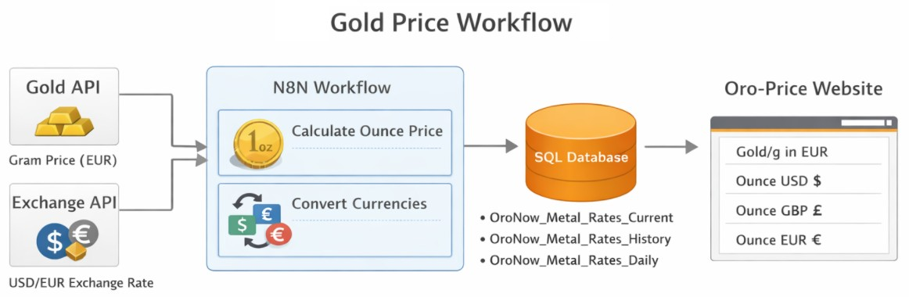

# n8n Workflow Technical Documentation

  

  "Describe Gold-Price Flow"
  &nbsp;&nbsp;&nbsp;&nbsp;&nbsp;&nbsp;&nbsp;&nbsp;&nbsp;&nbsp;&nbsp;&nbsp;&nbsp;&nbsp;&nbsp;

## 1. Scope

This document describes all workflow files currently stored in:

`Get_Oro_Price_Webhook_N8N_API/Workflow-in-production`

Covered workflow files:

- `Gold Price.json`
- `Metal Rates Integration - Error LOG.json`
- `Webhook - Gold Price REST API.json`

The goal of this folder is to:

- collect the current 24K gold price from an external XML feed
- retrieve the USD-based foreign exchange rate needed by the data model
- store current, historical, and daily gold price records in SQL Server
- expose the latest price through a REST webhook
- centralize operational error logging and email alerts

## 2. High-Level Architecture

The solution is split into three workflows with separate responsibilities.

### 2.1 Gold Price

This is the main production workflow.

It:

- runs every 10 minutes
- calls the gold price provider
- calls the exchange rate API
- merges both payloads
- filters only 24K gold
- writes data to the SQL history and current tables
- creates one daily consolidated record at 00:05
- logs successful executions

### 2.2 Metal Rates Integration - Error LOG

This is the shared error-handling workflow.

It:

- receives execution failures through an `Error Trigger`
- normalizes the error payload
- writes the error entry to the SQL integration log table
- sends an email alert with execution details

### 2.3 Webhook - Gold Price REST API

This is the read-only integration API workflow.

It:

- exposes `GET /ouro/atual`
- reads the latest gold price from SQL Server
- formats the payload as JSON
- returns the result to external systems or websites

## 3. External Dependencies

The workflows depend on the following external services:

- Gold price provider XML endpoint
- Exchange rate API at `https://open.er-api.com/v6/latest/USD`
- SQL Server
- SMTP server for error notifications

The provider URL inside the workflow files is intentionally sanitized and should be configured with the real endpoint before production use.

## 4. SQL Tables Used

The workflows reference the following SQL tables.

### 4.1 `Metal_Rates_Current`

Stores the latest available 24K gold price.

Used by:

- `Gold Price.json`
- `Webhook - Gold Price REST API.json`

Typical fields referenced in the workflows:

- `ExecutionId`
- `Material`
- `Carati`
- `Valor`
- `RateDate`
- `Price_USD_EU`
- `Oz_Price`
- `UpdatedAt`

### 4.2 `Metal_Rates_History`

Stores the historical series of imported prices.

Used by:

- `Gold Price.json`

Typical fields referenced in the workflows:

- `ExecutionId`
- `Material`
- `Carati`
- `Valor`
- `RateDate`
- `RawJson`
- `Price_USD_EU`
- `Oz_Price`

### 4.3 `Metal_Rates_Daily`

Stores one daily consolidated record for the previous day.

Used by:

- `Gold Price.json`

Typical fields referenced in the workflows:

- `RateDate`
- `Material`
- `Carati`
- `Valor`
- `RawJson`
- `ExecutionId`
- `Price_USD_EU`
- `Oz_Price`
- `CreatedAt`

### 4.4 `Integration_Log`

Stores technical execution logs for success and error events.

Used by:

- `Gold Price.json`
- `Metal Rates Integration - Error LOG.json`

Typical fields referenced in the workflows:

- `ExecutionId`
- `Status`
- `Message`

## 5. Workflow: `Gold Price.json`

### 5.1 Purpose

This workflow is the operational core of the folder.

It has two independent scheduled processes:

- current price synchronization every 10 minutes
- daily snapshot generation at `00:05`

### 5.2 Main Node Groups

The workflow contains two functional branches:

1. Current price synchronization
2. Daily snapshot generation

It also points to the dedicated error workflow through the workflow settings.

### 5.3 Current Price Synchronization

#### Step 1. Start trigger

Node: `Schedule Trigger1`

Type: `n8n-nodes-base.scheduleTrigger`

Behavior:

- starts automatically every 10 minutes
- launches two parallel branches

Parallel branches:

- gold feed branch
- exchange rate branch

#### Step 2. Gold feed request

Node: `HTTP Request`

Type: `n8n-nodes-base.httpRequest`

Behavior:

- calls the external XML price feed
- expects a text response
- retries on failure

#### Step 3. XML parsing

Node: `XML1`

Type: `n8n-nodes-base.xml`

Behavior:

- converts the raw XML response into JSON
- makes the provider payload usable by downstream code

#### Step 4. FX request

Node: `HTTPGetCurrency1`

Type: `n8n-nodes-base.httpRequest`

Behavior:

- calls `https://open.er-api.com/v6/latest/USD`
- retrieves the foreign exchange payload used by the workflow

#### Step 5. FX extraction and timestamp normalization

Node: `GetOnlyUSD1`

Type: `n8n-nodes-base.code`

Behavior:

- reads `rates.EUR` from the API payload
- validates that the expected rate exists
- normalizes `time_last_update_utc` into ISO 8601 with a `Z` suffix
- returns a compact JSON object containing:
  - `coin`
  - `price`
  - `market_data_at`
  - `processed_at_utc`

Important note:

- the node name suggests USD handling, but the current code extracts the EUR rate from a USD-based response

#### Step 6. Merge provider data and FX data

Node: `Merge1`

Type: `n8n-nodes-base.merge`

Mode: `combineByPosition`

Behavior:

- merges the parsed gold feed item and the FX item into a single record
- ensures the downstream transformation receives both payloads together

#### Step 7. Business transformation and SQL generation

Node: `Code Function1`

Type: `n8n-nodes-base.code`

Main responsibilities:

- reads `valorioro.valoreoro` from the parsed provider payload
- iterates through all returned items
- keeps only:
  - `materiale === 'oro'`
  - `carati === 24`
  - valid and non-zero `valore`
- converts `lastdate` from `dd/MM/yyyy HH:mm:ss` to `yyyy-MM-dd HH:mm:ss`
- computes the troy ounce price using:

`price_per_gram * 31.1034768`

- escapes JSON content before SQL insertion
- builds a transactional SQL script

SQL operations generated by this node:

- conditional insert into `Metal_Rates_History`
- update or insert into `Metal_Rates_Current`

Failure conditions raised by the node:

- missing FX rate
- no valid 24K gold record found in the provider response

#### Step 8. Execute current and history writes

Node: `Metal_Rates_History`

Type: `n8n-nodes-base.microsoftSql`

Behavior:

- executes the SQL script generated by `Code Function1`
- writes both historical and current records
- retries on failure

Important note:

- despite the node name, the SQL executed here updates both history and current tables

#### Step 9. Log successful synchronization

Node: `Integration_Log`

Type: `n8n-nodes-base.microsoftSql`

Behavior:

- inserts a `SUCCESS` log entry into `Integration_Log`
- records that the synchronization completed successfully

### 5.4 Daily Snapshot Process

#### Step 1. Daily trigger

Node: `Schedule Daily 00:05`

Type: `n8n-nodes-base.scheduleTrigger`

Behavior:

- runs every day at `00:05`

#### Step 2. Build daily snapshot SQL

Node: `Generate Daily SQL`

Type: `n8n-nodes-base.code`

Behavior:

- targets the previous calendar day
- checks whether a daily row for 24K gold already exists
- if not present, selects the latest historical record from that day
- builds a transactional SQL statement to insert one row into `Metal_Rates_Daily`

#### Step 3. Execute daily insert

Node: `Insert Daily Price`

Type: `n8n-nodes-base.microsoftSql`

Behavior:

- executes the SQL generated by `Generate Daily SQL`

#### Step 4. Log successful daily process

Node connected after `Insert Daily Price`: `Integration_Log`

Behavior:

- inserts a `SUCCESS` log entry after the daily snapshot completes

### 5.5 Workflow Settings and Error Routing

The workflow settings include an `errorWorkflow` reference.

Operational meaning:

- if an execution fails, n8n forwards the failure to the dedicated error workflow
- the main workflow therefore stays focused on business processing
- alerting and error persistence are delegated to the separate error flow

## 6. Workflow: `Metal Rates Integration - Error LOG.json`

### 6.1 Purpose

This workflow is dedicated to centralized failure handling.

It is designed to receive execution errors from other workflows and transform them into:

- structured SQL log entries
- email alerts

### 6.2 Step-by-Step Flow

#### Step 1. Receive workflow failure

Node: `Error Trigger`

Type: `n8n-nodes-base.errorTrigger`

Behavior:

- starts automatically when a linked workflow fails

#### Step 2. Normalize the error payload

Node: `Code in origem (funciona)`

Type: `n8n-nodes-base.code`

Behavior:

- reads the error payload directly from `Error Trigger`
- extracts:
  - `executionId`
  - `mode`
  - `workflowName`
  - `errorMessage`
  - `errorNode`
  - `errorStack`
  - `errorType`
  - `timestamp`
  - `rawDump`
- sanitizes the main text fields for safer SQL usage

#### Step 3. Persist the error in SQL

Node: `Microsoft SQL`

Type: `n8n-nodes-base.microsoftSql`

Behavior:

- inserts an `ERROR` entry into `Integration_Log`
- stores both the failed node name and the message text

#### Step 4. Send email alert

Node: `Send an Email Erro Log`

Type: `n8n-nodes-base.emailSend`

Behavior:

- sends an operational alert email
- includes:
  - workflow name
  - execution ID
  - mode
  - timestamp
  - failed node
  - error type
  - message
  - stack trace
  - raw error dump

Operational value:

- enables rapid diagnosis without opening the n8n execution details first

## 7. Workflow: `Webhook - Gold Price REST API.json`

### 7.1 Purpose

This workflow exposes the latest gold price as a simple JSON endpoint for external systems.

### 7.2 Endpoint

Node: `Webhook GET /ouro/atual`

Type: `n8n-nodes-base.webhook`

Behavior:

- exposes a GET endpoint at `/ouro/atual`
- uses `responseNode` mode
- allows cross-origin requests

### 7.3 Step-by-Step Flow

#### Step 1. Receive HTTP request

Node: `Webhook GET /ouro/atual`

Behavior:

- receives inbound GET requests
- passes control to the SQL read node

#### Step 2. Read latest current price from SQL

Node: `SQL — Read Current Gold Price`

Type: `n8n-nodes-base.microsoftSql`

Behavior:

- selects the most recent row from `Metal_Rates_Current`
- filters on:
  - `Material = 'oro'`
  - `Carati = 24`
- sorts by `UpdatedAt DESC`
- returns the latest record only

#### Step 3. Format JSON payload

Node: `Code — Format JSON Response`

Type: `n8n-nodes-base.code`

Behavior:

- reads the first SQL result row
- if no row is returned, produces:
  - `success: false`
  - error message
  - timestamp
- if a row exists, produces:
  - `success: true`
  - `data.material`
  - `data.carati`
  - `data.valor_grama`
  - `data.oz_price`
  - `data.usd_eur`
  - `data.rate_date`
  - `data.updated_at`
  - `source`
  - `fetched_at`

#### Step 4. Return the HTTP response

Node: `Respond to Webhook — JSON`

Type: `n8n-nodes-base.respondToWebhook`

Behavior:

- returns the formatted JSON payload
- sets:
  - HTTP status `200`
  - `Content-Type: application/json`
  - `Access-Control-Allow-Origin: *`
  - `Cache-Control: no-cache, no-store, must-revalidate`

### 7.4 Intended Consumers

This workflow is suitable for:

- websites
- internal backends
- middleware services
- client-side polling integrations

## 8. End-to-End Operational Sequence

### 8.1 Scheduled synchronization sequence

1. `Schedule Trigger1` starts every 10 minutes.
2. The workflow requests the XML gold feed.
3. The workflow requests the FX payload.
4. The XML is converted to JSON.
5. The FX payload is normalized.
6. Both branches are merged.
7. Only valid 24K gold records are kept.
8. Current and historical SQL statements are generated.
9. SQL writes are executed.
10. A success entry is stored in `Integration_Log`.

### 8.2 Daily snapshot sequence

1. `Schedule Daily 00:05` starts once per day.
2. SQL for the previous-day snapshot is generated.
3. The daily record is inserted into `Metal_Rates_Daily`.
4. A success entry is stored in `Integration_Log`.

### 8.3 Error sequence

1. A workflow execution fails.
2. The dedicated error workflow starts.
3. The error payload is normalized and sanitized.
4. An `ERROR` entry is inserted into `Integration_Log`.
5. An email alert is sent to the configured recipients.

### 8.4 API sequence

1. A client calls `GET /ouro/atual`.
2. SQL reads the latest current price.
3. The result is converted into a clean JSON payload.
4. The workflow responds with JSON.

## 9. Validation and Safety Controls

The workflows implement the following controls.

- validation that the FX rate exists in the API response
- strict filtering for gold only
- strict filtering for 24K only
- skipping invalid or zero values
- timestamp normalization before downstream usage
- SQL transaction blocks for write operations
- duplicate protection for historical and daily inserts
- SQL text sanitization in the error workflow
- centralized alerting through a dedicated error flow

## 10. Operational Notes

- All three workflow JSON files are currently active.
- The workflow file names and internal labels have been sanitized.
- The SQL connection name is generic and may need remapping after import.
- The provider endpoint is represented by a placeholder and must be configured with the real URL.
- Email addresses in the error workflow are generic placeholders and should be updated before production use.
- The API workflow currently returns `success: false` instead of throwing when no SQL row is found.

## 11. Recommended Test Checklist

### 11.1 Main synchronization test

- run the main workflow manually
- verify that the provider request succeeds
- verify that the FX request succeeds
- verify that one 24K gold record is written to:
  - `Metal_Rates_History`
  - `Metal_Rates_Current`
- verify that `Integration_Log` receives a `SUCCESS` entry

### 11.2 Daily snapshot test

- run the daily branch around a dataset that already contains yesterday's history
- verify that a row is written to `Metal_Rates_Daily`
- verify that `Integration_Log` receives a `SUCCESS` entry

### 11.3 Error workflow test

- force a failure in the main workflow
- verify that `Metal Rates Integration - Error LOG.json` starts
- verify that `Integration_Log` receives an `ERROR` entry
- verify that the alert email is delivered

### 11.4 API test

- call `GET /ouro/atual`
- verify response structure
- verify values match the latest row in `Metal_Rates_Current`
- verify CORS and cache headers are present

